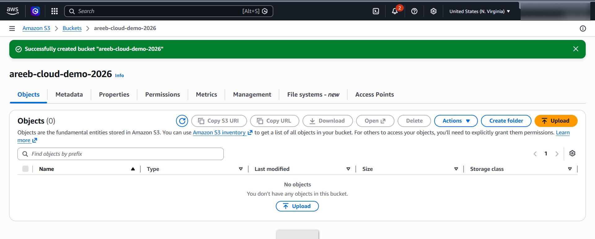
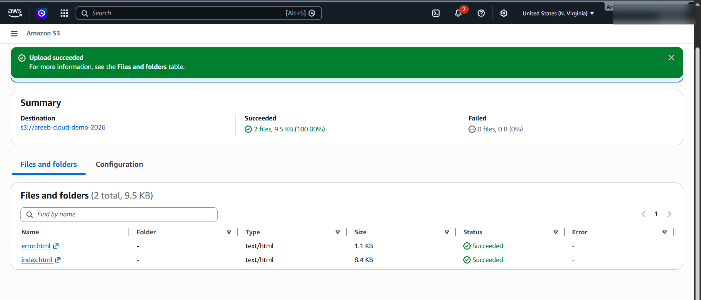
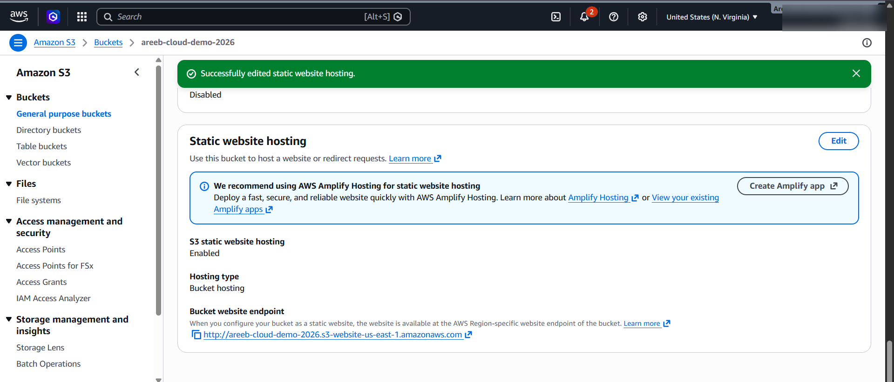
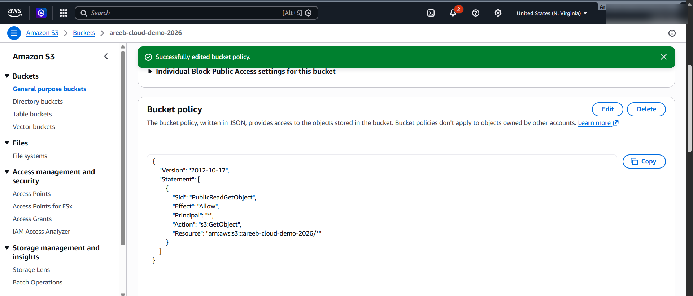
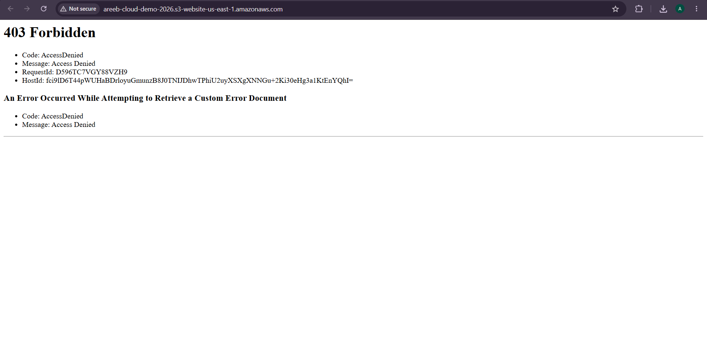
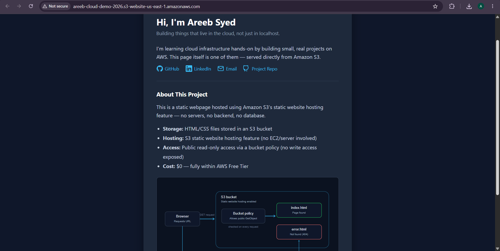

# AWS S3 Static Website Hosting

A simple static webpage hosted on Amazon S3 using its static website hosting feature — no servers, no backend, no database. Built as a hands-on introduction to core AWS concepts: object storage, public access policies, and static content delivery.

**Live URL:** [http://areeb-cloud-demo-2026.s3-website-us-east-1.amazonaws.com](http://areeb-cloud-demo-2026.s3-website-us-east-1.amazonaws.com)

---

## Architecture

The browser sends an HTTP GET request to the S3 static website endpoint. Inside the bucket, a bucket policy checks that the request is a public read, then S3 returns the requested object — `index.html` on success, or `error.html` if the page doesn't exist.

```
Browser --GET request--> S3 Bucket [Bucket Policy: public GetObject]
                              |
                    ┌─────────┴─────────┐
                index.html          error.html
              (200 OK, found)     (404, not found)
                              |
Browser <---- returns page ---┘
```

**Components used:**
- **S3 bucket** — object storage for the site files
- **Static website hosting** — S3 feature that serves `index.html`/`error.html` directly, no server needed
- **Bucket policy** — grants public *read-only* access (`s3:GetObject`), nothing is publicly writable

**Cost:** $0 — entirely within the AWS Free Tier.

**Note:** This bucket serves over HTTP only. S3 static website endpoints don't support HTTPS natively — adding TLS would require putting CloudFront in front of the bucket with an ACM certificate. That's a natural next step, but kept out of scope here to focus on core S3 concepts.

---

## Steps taken

1. Created an S3 bucket with a globally unique name, in region `us-east-1` (N. Virginia)
2. Uploaded `index.html` and `error.html` to the bucket
3. Enabled **Static website hosting** under the bucket's Properties tab, set `index.html` as the index document and `error.html` as the error document
4. Added a bucket policy allowing public `s3:GetObject` access, scoped only to this bucket
5. Verified the site loads at the generated website endpoint
6. Verified error handling by visiting a non-existent path and confirming `error.html` renders

---

## Screenshots

| Step | Screenshot |
|---|---|
| Bucket created |  |
| Files uploaded |  |
| Static hosting enabled |  |
| Bucket policy added |  |
| **Before policy** — 403 Forbidden |  |
| **After policy** — site live |  |

Before the bucket policy was added, the site returned a `403 Forbidden` even though static hosting was enabled — S3 blocks all access by default until a policy explicitly allows it. After adding a policy granting public `s3:GetObject`, the same URL served the page correctly. This step-by-step comparison is intentional: it shows the policy isn't just boilerplate, it's the actual gate controlling access.

*(AWS Account ID and any billing details are cropped/blurred out of all console screenshots for privacy.)*

---

## What I learned

- How S3's static website hosting differs from just storing files in a bucket
- How bucket policies work, and how to scope permissions to exactly what's needed (public read, nothing else)
- How to verify a deployment properly, not just assume it works — including testing the error path

---

## Repo structure

```
aws-s3-static-hosting/
├── site/
│   ├── index.html
│   └── error.html
├── screenshots/
└── README.md
```

---

## Contact

- GitHub: [4reeb-5yed](https://github.com/4reeb-5yed)
- LinkedIn: [areeb-syed](https://www.linkedin.com/in/areeb-syed-b19491245)
- Email: 4reeb.5yed@gmail.com